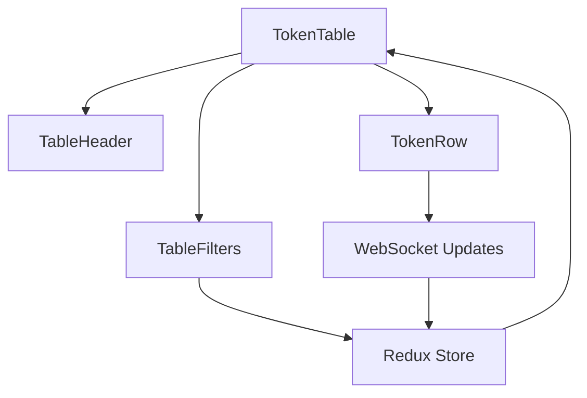

# Token Trading Table

A real-time token trading dashboard built with Next.js 14, TypeScript, and Tailwind CSS.

## Prerequisites

Before you begin, ensure you have the following installed on your Windows machine:

1. [Node.js](https://nodejs.org/) (version 18 or higher)
2. [Git](https://git-scm.com/download/win)
3. A code editor like [Visual Studio Code](https://code.visualstudio.com/)

## Getting Started

### Quick Setup (Windows PowerShell)

You can use our automated setup script on Windows:

1. Clone the repository:
```bash
git clone https://github.com/yourusername/token-trading-table.git
cd token-trading-table
```

2. Run the setup script:
```powershell
Set-ExecutionPolicy -Scope Process -ExecutionPolicy Bypass
.\setup.ps1
```

### Manual Setup

Follow these steps to run the project locally:

1. **Clone the Repository**

```bash
# Open Command Prompt or PowerShell and run:
git clone https://github.com/yourusername/token-trading-table.git
cd token-trading-table
```

2. **Install Dependencies**

```bash
# Using npm
npm install

# Or using yarn
yarn install

# Or using pnpm
pnpm install
```

3. **Set up Environment Variables**

Create a file named `.env.local` in the root directory and add:

```env
NEXT_PUBLIC_API_URL=http://localhost:3000/api
NEXT_PUBLIC_WS_URL=ws://localhost:3000/api/ws
```

4. **Run the Development Server**

```bash
# Using npm
npm run dev

# Or using yarn
yarn dev

# Or using pnpm
pnpm dev
```

5. **Open the Application**

Open your web browser and navigate to [http://localhost:3000](http://localhost:3000)

## Features

- Real-time token price updates
- Sorting and filtering capabilities
- Advanced search functionality
- Responsive design
- Loading states and animations
- WebSocket integration (mocked for development)

## Project Structure

```
token-trading-table/
├── src/
│   ├── app/              # Next.js app router pages
│   ├── components/       # React components
│   │   ├── layout/      # Layout components
│   │   ├── table/       # Table-related components
│   │   └── ui/          # Reusable UI components
│   ├── hooks/           # Custom React hooks
│   ├── lib/             # Utility functions and configurations
│   ├── store/           # Redux store and slices
│   └── types/           # TypeScript type definitions
├── public/              # Static assets
├── .env.local          # Environment variables
├── next.config.js      # Next.js configuration
├── tailwind.config.ts  # Tailwind CSS configuration
└── tsconfig.json       # TypeScript configuration
```

## Common Issues & Solutions

1. **Port Already in Use**
   ```bash
   # Kill the process using port 3000
   netstat -ano | findstr :3000
   taskkill /PID <PID> /F
   ```

2. **Node Modules Issues**
   ```bash
   # Remove node_modules and reinstall
   rm -rf node_modules
   rm -rf .next
   npm install
   ```

3. **WebSocket Connection Issues**
   - The WebSocket connection is mocked for development
   - Check if your firewall is blocking WebSocket connections
   - Ensure the `NEXT_PUBLIC_WS_URL` environment variable is set correctly

## Development Commands

```bash
# Start development server
npm run dev

# Build for production
npm run build

# Start production server
npm start

# Run type checking
npm run typecheck

# Run linting
npm run lint
```

## Notes for Windows Users

1. **PowerShell Execution Policy**: If you can't run the setup script, you might need to adjust the execution policy:
   ```powershell
   # For the current PowerShell session only
   Set-ExecutionPolicy -Scope Process -ExecutionPolicy Bypass
   
   # Or for all PowerShell sessions (requires admin)
   Set-ExecutionPolicy -Scope CurrentUser -ExecutionPolicy RemoteSigned
   ```

2. **Administrator Access**: Some operations require admin privileges:
   - Right-click PowerShell/Command Prompt
   - Select "Run as administrator"

3. **Common Fixes**:
   - For EACCES errors:
     ```bash
     npm cache clean --force
     ```
   - For path issues, use backslashes (\\) or forward slashes (/)
   - For Git CRLF warnings:
     ```bash
     git config --global core.autocrlf true
     ```

4. **Node.js Version Management**: 
   Install [nvm-windows](https://github.com/coreybutler/nvm-windows) to manage Node.js versions:
   ```powershell
   nvm install 18.17.0
   nvm use 18.17.0
   ```

## Troubleshooting

If you encounter any issues:

1. Ensure all dependencies are installed
2. Check if Node.js version is 18 or higher
3. Verify environment variables are set correctly
4. Clear Next.js cache:
   ```bash
   # Remove .next folder
   rm -rf .next
   # Restart development server
   npm run dev
   ```

## Contributing

1. Fork the repository
2. Create your feature branch (`git checkout -b feature/amazing-feature`)
3. Commit your changes (`git commit -m 'Add some amazing feature'`)
4. Push to the branch (`git push origin feature/amazing-feature`)
5. Open a Pull Request

# Design Documentation

## Architecture Overview

This document outlines the key design decisions and architecture of the Token Trading Table application.

### Core Technologies

- **Next.js 14**: Chosen for server-side rendering capabilities, built-in API routes, and modern React features
- **TypeScript**: Ensures type safety and better developer experience
- **Redux Toolkit**: Manages complex application state, especially for real-time trading data
- **TanStack Query**: Handles server state and caching for API calls
- **Tailwind CSS**: Provides utility-first styling with good developer experience and performance

## Key Design Decisions

### 1. Component Architecture

#### Layout Structure
- `src/components/layout/`: Contains reusable layout components
  - `Header.tsx`: App header with navigation and user controls
  - `StatsFooter.tsx`: Displays real-time market statistics

#### UI Component Library
- `src/components/ui/`: Custom UI components built for reusability
  - Follows atomic design principles
  - Each component is self-contained with its own types and styles
  - Uses composition pattern for flexibility

### 2. State Management Strategy

#### Application State (Redux)
- **Token Data**: Managed in `tokensSlice.ts`
  - Real-time price updates
  - Trading pair information
  - Market statistics
- **UI State**: Managed in `uiSlice.ts`
  - Sorting preferences
  - Filter settings
  - View configurations

#### Server State (TanStack Query)
- Used for API data fetching and caching
- Implements optimistic updates for better UX
- Handles error states and retries

### 3. Real-time Updates

#### WebSocket Implementation
- Custom `useWebSocket` hook in `src/hooks/`
- Middleware pattern for Redux integration
- Mocked implementation for development
- Automatic reconnection handling

#### Data Flow
1. Initial data loaded via REST API
2. Real-time updates received through WebSocket
3. Updates processed by Redux middleware
4. UI components react to state changes

### 4. Performance Optimizations

#### Rendering Optimization
- Virtual scrolling for large datasets
- Memoized components to prevent unnecessary rerenders
- Debounced search and filter operations

#### Data Management
- Efficient data normalization in Redux store
- Selective updates to prevent full table rerenders
- Cached API responses with TanStack Query

### 5. Error Handling

#### Strategy
- Global error boundary for React errors
- Typed API responses for better error handling
- Graceful degradation when WebSocket fails
- User-friendly error messages and recovery options

### 6. Accessibility

- ARIA labels and roles implemented
- Keyboard navigation support
- Color contrast compliance
- Screen reader friendly markup

## Component Communication



## Future Considerations

1. **Scalability**
   - Implement pagination for larger datasets
   - Add server-side filtering and sorting
   - Consider WebSocket message batching

2. **Features**
   - Add advanced charting capabilities
   - Implement user preferences persistence
   - Add more trading pair analytics

3. **Performance**
   - Implement service workers for offline support
   - Add progressive loading for large datasets
   - Optimize WebSocket message frequency

## Testing Strategy

- Unit tests for utility functions and hooks
- Component tests with React Testing Library
- Integration tests for critical user flows
- E2E tests for main trading features

## Security Considerations

- Rate limiting on API routes
- Input validation and sanitization
- CSRF protection
- Secure WebSocket connection handling

## Development Workflow

- Feature branching strategy
- Automated testing in CI/CD
- Code review requirements
- Documentation updates with code changes
